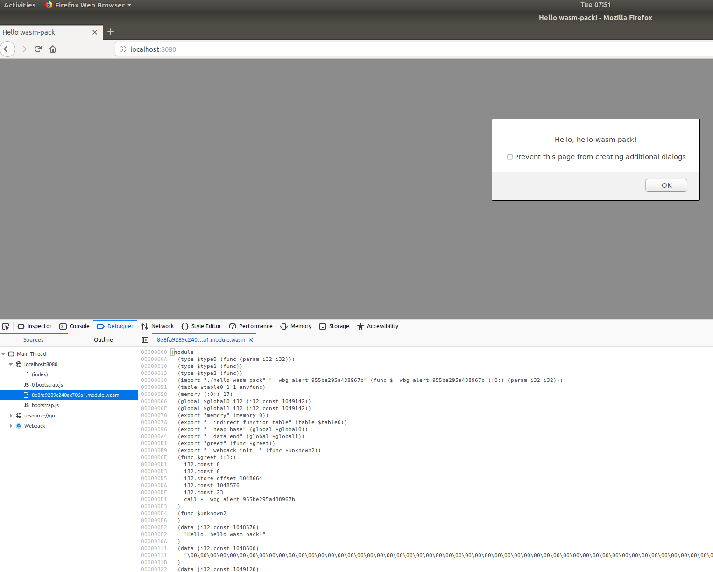

# Lesson Nineteen: Web Assembly 

## Objectives 
- Understand Web Assembly Essentials with Rust 

_______

## Overview 

Because of some limitations with javascript *and* to allow programmers to write web application code in other languages, web assembly (WASM) was approved and implemented. 

Web Assembly is an intermediate language (il) that is currrently supported in all the major browsers. 

Java and .NET programmers may be familiar with the il for their languages (msil for .NET and bytecode for Java).  Any dotnet or java code can be disassembled:

Here is HelloWorld in .NET 4.0:

```rust
// Metadata version: v4.0.30319  
.assembly extern mscorlib  
{  
  .publickeytoken = (B7 7A 5C 56 19 34 E0 89 )                         // .z\V.4..  
  .ver 4:0:0:0  
}  
.assembly Hello  
{  
  .custom instance void [mscorlib]System.Runtime.CompilerServices.CompilationRelaxationsAttribute::.ctor(int32) = ( 01 00 08 00 00 00 00 00 )   
  .custom instance void [mscorlib]System.Runtime.CompilerServices.RuntimeCompatibilityAttribute::.ctor() = ( 01 00 01 00 54 02 16 57 72 61 70 4E 6F 6E 45 78   // ....T..WrapNonEx  
                                                                                                             63 65 70 74 69 6F 6E 54 68 72 6F 77 73 01 )       // ceptionThrows.  
  .hash algorithm 0x00008004  
  .ver 0:0:0:0  
}  
.module Hello.exe  
// MVID: {7C2770DB-1594-438D-BAE5-98764C39CCCA}  
.imagebase 0x00400000  
.file alignment 0x00000200  
.stackreserve 0x00100000  
.subsystem 0x0003       // WINDOWS_CUI  
.corflags 0x00000001    //  ILONLY  
// Image base: 0x00600000  

```


```rust
(module
  (type (;0;) (func (result i32)))
  (type (;1;) (func (param i32)))
  (type (;2;) (func (param i32 i32)))
  (type (;3;) (func (param i32) (result i32)))
  (type (;4;) (func))
  (type (;5;) (func (param i32 i32) (result i32)))
  (type (;6;) (func (param i32 i32 i32)))
  (type (;7;) (func (param i32 i32 i32 i32) (result i32)))
  (type (;8;) (func (param i32 i32 i32) (result i32)))
  (import "__wbindgen_placeholder__" "__wbindgen_describe" (func (;0;) (type 1)))
  (import "__wbindgen_placeholder__" "__wbg_alert_9b0fc9082f05403d" (func (;1;) (type 2)))
  (import "__wbindgen_anyref_xform__" "__wbindgen_anyref_table_grow" (func (;2;) (type 3)))
  (import "__wbindgen_anyref_xform__" "__wbindgen_anyref_table_set_null" (func (;3;) (type 1)))
  (func (;4;) (type 4)
    call 25
    i32.const 11
    call 0
    i32.const 0
    call 0
    i32.const 1
    call 0
    i32.const 15
    call 0
    call 12
    call 11)
  (func (;5;) (type 4)
...
    i32.const 1048576
  (func (;8;) (type 6) (param i32 i32 i32)
```

[Screencast: Generating WAT (wasm in readable text format) from WASM](https://asciinema.org/a/dLEdBBNjYLJYUjsJmBjFRjOKb)

_______

## Getting Started with WASM in Rust


[Video Overview: Getting Started with WASM in Rust](https://asciinema.org/a/QnwFimNAYwDZWPyBc8qfUJrbU)

Rust has excellent support for web assembly.  In fact, there's a guide specifically for Rust and Web Assembly:

[Rust Web Assembly Book] (https://rustwasm.github.io/docs/book/introduction.html)

There are two primary ways to work with Web Assembly in Rust: `wasm-pack` and directly with `wasm-bindgen`. `wasm-pack` uses `wasm-bindgen` and provides tooling for npm integration.

The documentation takes you through the process of creating an web assembly and then using it on the web with npm packaging. 

At a high-levl this is the process:

1 - Follow the instructions for `wasm-pack` installation [wasm-pack](https://rustwasm.github.io/docs/book/game-of-life/setup.html#the-rust-toolchain) 

2 - After setup, we create a new project with: the `cargo generate --git https://github.com/rustwasm/wasm-pack-template`

3 - To build, we run: `wasm-pack build` and our package is output:  ```Your wasm pkg is ready to publish at ./pkg.``

4 - To web enable the app, from the main project directory (not .pkg), we run: `npm init wasm-app www`.

5 - We then cd into the `www` we just created and install our npm dependencies: `npm install`


Running in Firefox:



_______

### The basics with `wasm-bindgen` + webpack

`NOTE: In the next two samples we are using npm with a plugin for webpack.  wasm has no dependency on npm`


After npm install and npm build, the pkg directory is built:

```bash
drwxr-xr-x     - john 19 Sep  7:09 ├── pkg
.rw-r--r--    95 john 19 Sep  7:09 │  ├── index.d.ts
.rw-r--r--  3.4k john 19 Sep  7:09 │  ├── index.js
.rw-r--r--   244 john 19 Sep  7:09 │  ├── index_bg.d.ts
.rw-r--r--   59k john 19 Sep  7:09 │  ├── index_bg.wasm
.rw-r--r--   256 john 19 Sep  7:09 │  ├── package.json
.rw-r--r--   407 john 19 Sep  7:09 │  └── README.md
.rw-r--r--   407 john 18 Sep 23:58 ├── README.md
```

The process:
`webpack -> index.js -> ./pkg/`

`webpack config`

```javascript
const path = require('path');
const HtmlWebpackPlugin = require('html-webpack-plugin');
const webpack = require('webpack');
const WasmPackPlugin = require("@wasm-tool/wasm-pack-plugin");

module.exports = {
    entry: './index.js',
    output: {
        path: path.resolve(__dirname, 'dist'),
        filename: 'index.js',
    },
    plugins: [
        new HtmlWebpackPlugin(),
        new WasmPackPlugin({
            crateDirectory: path.resolv

```

`main.rs`

```rust, no_run
use wasm_bindgen::prelude::*;
use wasm_bindgen::Clamped;
use web_sys::console::log;
use web_sys::{console, CanvasRenderingContext2d, ImageData};


#[wasm_bindgen]
pub fn transform_bird(
    ctx: &CanvasRenderingContext2d,
    width: u32,
    height: u32,
) -> Result<(), JsValue> {

    let mut data = render(width, height);
    let data = ImageData::new_with_u8_clamped_array_and_sh(Clamped(&mut data), width, height)?;
    ctx.put_image_data(&data, 0.0, 0.0)
}

fn render(width: u32, height: u32) -> Vec<u8> {
    let mut data = Vec::new();

    data
}
```

_______

## Why use WASM?

The primary reasons for using `wasm` are:

1 - Use existing code libraries in a browser without rewriting them 

2 - Letting developers work in their preferred language,

3 - Performance


   #### Sample library in WASM: e.g. the large scientific libraries in python: [pyodide](https://hacks.mozilla.org/2019/04/pyodide-bringing-the-scientific-python-stack-to-the-browser)


_______
## Performance Details


There's overhead associated with calls between the browser and a web assembly:

```ru
            1              2
         ======>        =====>       \
Browser         WebWorker      Rust   ||
         <======        <=====      <=/
            4              3
```
[source](https://stackoverflow.com/questions/53918351/is-there-a-performance-gain-to-use-web-sys-instead-of-plain-old-javascript)


and we have some detailed analysis here:

[Performance Analysis: Native Code vs. WASM + asm.js](https://www.usenix.org/system/files/atc19-jangda.pdf)

The rough conclusions from this research: is that WASM is ~1.2 - ~2x slower than native code and the details are very much dependent on the algorithm and datastructures.  asm.js out-performs plain JS ~1.3x, WASM out-performs asm.js ~1.3x, and native code out-performs WASM by ~1.2 to 2x. The same research also makes suggestions on optimizing WASM's code generation.


SIMD (single instruction multiple data) support (currently in beta for WASM) could massively increase performance for matrix-style operations. 

_______
## Known Limitations: 

1 - Boxed by javascript, so the number of calls between `wasm` and `javascript` has a negative performance impact.

2 - Currently, no support for multi-threading.  

3 - No native socket calls (but web api calls are supported)

4 - All the major browsers support WASM, but some do not.  (as a work-around, [wasm2js](https://github.com/WebAssembly/binaryen) is a library to convert wasm to js)


Regarding the threading model, if you actually try to spawn a thread then it will panic, because wasm is single-threaded only right now.

However, most "thread-specific" things like Mutex, Arc, and atomics will work just fine.

They'll compile down into an efficient single-threaded implementation so it's only really spawning a thread which isn't supported right now.

_______
## The Bleeding Edge: Wasmtime and WASI 

There is a proposal to extend the he shared assembly standard beyond the browser.  The proposal is for `wasi` which is a runtime with file system access and other standard POSIX-like features, but securely sandboxed.

1 - `cargo new --bin demo` 

2 - `rustup target add wasm32-wasi`

3 - `cargo build --target wasm32-wasi`

4 - install [wasmtime](https://wasmtime.dev/) - a vm/runtime for wasm and wasi

5 - run the code above with: ` wasmtime demo.wasm`

_______

## Resources

The web api samples here are excellent.  Some of the them are broken and evolving with the specication for wasm.  [bindgen](https://github.com/rustwasm/wasm-bindgen)

### Exercise - Similar to the exercise on File I/O, use wasm to transform an image.  There is a skeleton of the project in /demos/khems_bird/


